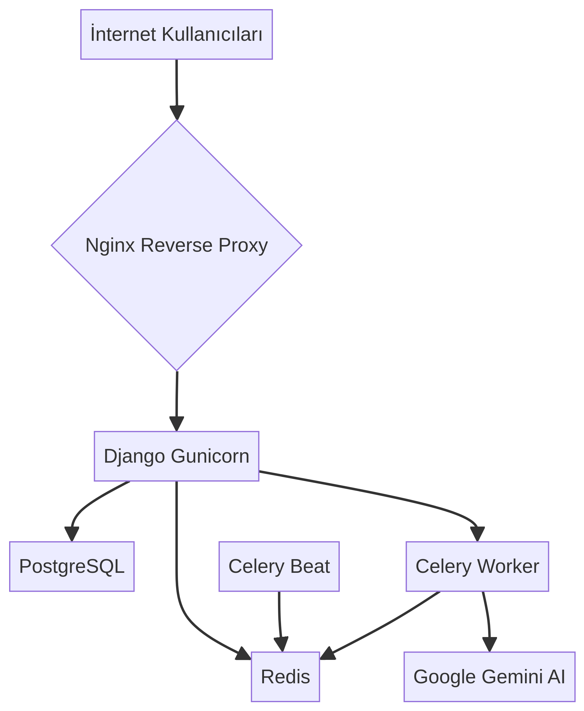
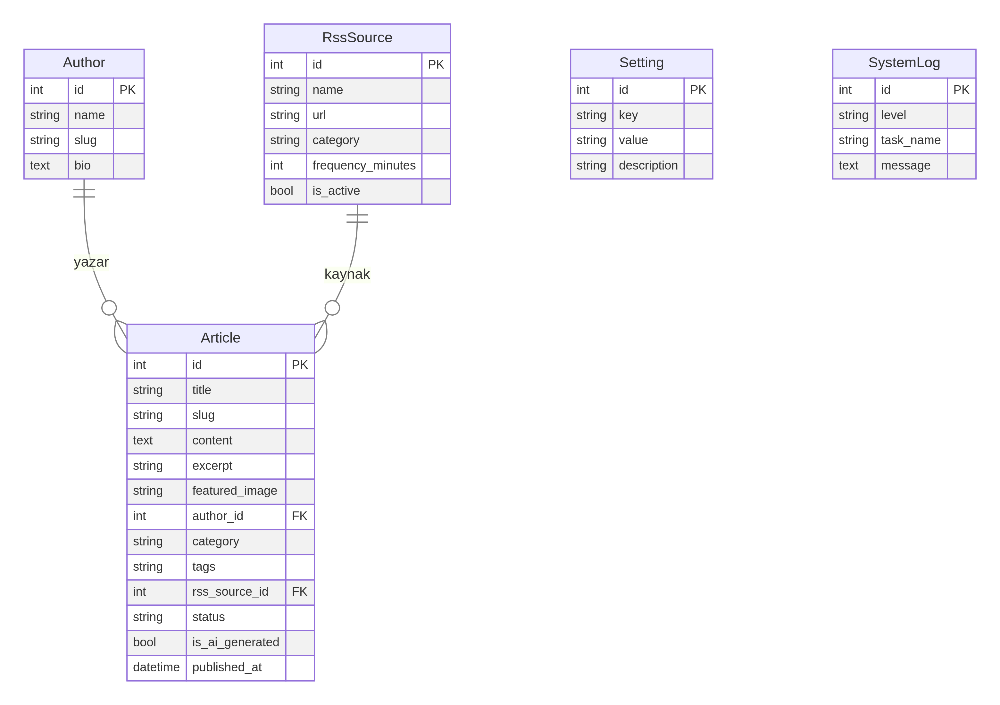

# HaberNexus Projesi: Kapsamlı Analiz ve Değerlendirme Raporu

**Tarih:** 14 Aralık 2025  
**Yazar:** Manus AI  
**Geliştirici:** Salih TANRISEVEN

---

## 1. Proje Özeti

HaberNexus, Google Gemini AI kullanarak RSS kaynaklarından tam otomatik, SEO uyumlu ve profesyonel haber içeriği üreten yeni nesil bir haber ajansı platformudur. Proje, modern bir teknoloji yığını üzerine inşa edilmiş olup, asenkron görev işleme, gelişmiş içerik kalite kontrolü ve Docker ile kolay kurulum gibi özellikler sunmaktadır. Bu rapor, projenin kod tabanını, mimarisini, dokümantasyonunu ve genel kalitesini derinlemesine analiz etmektedir.

### 1.1. Temel Bulgular

| Kategori | Bulgular |
|---|---|
| **Teknoloji Yığını** | Django 5, PostgreSQL 16, Redis 7, Celery 5.4, Docker | 
| **Kod Tabanı** | 60 Python dosyası, ~9,300 satır kod | 
| **Mimari** | Mikroservis benzeri yapı (7 Docker servisi) | 
| **Test Kapsamı** | 13 test dosyası, 111 test fonksiyonu, %71+ test kapsamı hedefi | 
| **CI/CD** | Kapsamlı GitHub Actions (test, lint, security, build) | 
| **Dokümantasyon** | Son derece detaylı ve profesyonel (13+ ana doküman) | 

---

## 2. Sistem Mimarisi

Proje, birbirinden bağımsız ancak birbiriyle entegre çalışan 7 adet Docker servisi üzerine kurulmuştur. Bu modüler yapı, ölçeklenebilirlik ve bakım kolaylığı sağlamaktadır.

### 2.1. Servis Bileşenleri

| Servis | Teknoloji | Görevi |
|---|---|---|
| **Nginx** | Nginx | Gelen istekleri karşılar, statik dosyaları servis eder ve Django uygulamasına reverse proxy yapar. |
| **App (Django)** | Django 5.0, Gunicorn | Ana iş mantığını, web arayüzünü ve API'leri barındırır. |
| **Database** | PostgreSQL 16 | Tüm uygulama verilerini (haberler, kullanıcılar, ayarlar) saklar. |
| **Cache/Broker** | Redis 7 | Celery için görev kuyruğu (broker) ve sonuç deposu (backend) olarak görev yapar. |
| **Celery Worker** | Celery 5.4 | Arka planda uzun süren görevleri (içerik üretimi, görsel işleme) asenkron olarak çalıştırır. |
| **Celery Beat** | Celery Beat | Periyodik görevleri (RSS tarama, log temizleme) zamanlar ve tetikler. |
| **Flower** | Flower | Celery görevlerini izlemek için bir web arayüzü sunar. |

Bu mimari, yüksek trafikli bir haber sitesinin ihtiyaçlarını karşılamak üzere tasarlanmıştır. Özellikle Celery'nin kullanımı, kullanıcı deneyimini olumsuz etkilemeden arka planda yoğun işlemlerin yapılabilmesine olanak tanır.

---

## 3. Kod Tabanı Analizi

Projenin kod tabanı, Django'nun en iyi pratiklerine uygun olarak `core`, `news`, ve `authors` olmak üzere üç ana uygulama etrafında organize edilmiştir.

### 3.1. Proje Yapısı

- **`habernexus_config/`**: Ana Django proje ayarları, URL yönlendirmeleri ve Celery yapılandırmasını içerir.
- **`core/`**: Sistem genelindeki ayarları (`Setting` modeli) ve loglama mekanizmasını (`SystemLog` modeli) yönetir.
- **`news/`**: Projenin kalbidir. Haber (`Article`), RSS kaynağı (`RssSource`), içerik kalitesi (`ContentQualityMetrics`), başlık puanlama (`HeadlineScore`) gibi 10'dan fazla modeli ve tüm içerik üretim mantığını barındırır.
- **`authors/`**: Yazar profillerini (`Author` modeli) yönetir.
- **`scripts/`**: Kurulum, yedekleme ve sağlık kontrolü gibi otomasyon betiklerini içerir.
- **`docs/`**: Projenin olağanüstü detaylı dokümantasyonunu barındırır.

### 3.2. Veri Modeli

Proje, temel haber yapılarından gelişmiş kalite metriklerine kadar uzanan son derece kapsamlı bir veri modeline sahiptir. Toplamda 10'dan fazla model bulunmaktadır. Bu modeller, sadece içeriği saklamakla kalmaz, aynı zamanda içerik üretim sürecinin her aşamasını (puanlama, sınıflandırma, SEO) yönetir.

### 3.3. İçerik Üretim Pipeline'ı

Projenin en etkileyici kısmı, `news/tasks_v2.py` ve ilgili modüllerde tanımlanan çok aşamalı içerik üretim hattıdır.

1.  **RSS Tarama (`fetch_rss_feeds_v2`):** Aktif RSS kaynakları 15 dakikada bir taranır.
2.  **Başlık Puanlama (`score_headlines`):** Orijinallik, alaka ve zamanlılık gibi kriterlere göre başlıklar puanlanır.
3.  **AI Sınıflandırma (`classify_headlines`):** En yüksek puanlı başlıklar, içerik türüne (haber, analiz, vb.) göre sınıflandırılır.
4.  **Paralel İçerik Üretimi (`generate_ai_content_v2`):** Her başlık için paralel olarak Gemini AI kullanılarak içerik üretilir.
5.  **Kalite Kontrol (`calculate_quality_metrics`):** Üretilen içeriğin okunabilirliği, SEO skoru ve yapısal kalitesi ölçülür.
6.  **Görsel Üretimi (`generate_article_image_v2`):** İçerikle alakalı, profesyonel görseller üretilir.
7.  **Yayınlama:** Kalite kontrolünden geçen içerikler veritabanına kaydedilir ve yayınlanır.

Bu otomatize ve akıllı süreç, projenin temel değer önerisini oluşturmaktadır.

---

## 4. Kod Kalitesi ve En İyi Pratikler

Proje, kod kalitesi, test ve otomasyon konularında modern standartları benimsemiştir.

### 4.1. Kod Standartları ve Linting

- **Formatlama:** `black` ve `isort` kullanılarak kodun tamamında tutarlı bir formatlama sağlanmıştır. Bu, okunabilirliği artırır ve kod incelemelerini kolaylaştırır.
- **Linting:** `flake8` ve `pylint` ile potansiyel hatalar, stil sorunları ve "code smell" olarak adlandırılan kötü pratikler tespit edilir. `.pylintrc` ve `.flake8` dosyalarındaki yapılandırmalar, projenin ihtiyaçlarına göre özelleştirilmiştir.

### 4.2. Test Stratejisi

- **Kapsam:** Proje, birim (unit) ve entegrasyon (integration) testlerini içerir. `pytest` ve `pytest-django` kullanılarak 111'den fazla test senaryosu oluşturulmuştur.
- **Otomasyon:** Testler, her `push` ve `pull_request` işleminde GitHub Actions tarafından otomatik olarak çalıştırılır.
- **Test Ortamı:** CI/CD sürecinde `postgres` ve `redis` servisleri oluşturularak, production ortamına çok yakın bir ortamda testlerin güvenilirliği artırılmıştır.
- **Coverage:** Testlerin kod tabanının ne kadarını kapsadığını ölçmek için `pytest-cov` kullanılır ve sonuçlar `Codecov` platformuna yüklenir.

### 4.3. CI/CD Pipeline

Projenin `.github/workflows/` altındaki CI/CD pipeline'ı son derece profesyoneldir:

- **`ci.yml`:** Kodun kalitesini ve doğruluğunu güvence altına alır. Python'un 3 farklı versiyonunda (3.10, 3.11, 3.12) testleri çalıştırır, linting ve güvenlik taramaları yapar.
- **`security.yml`:** `Bandit` ile statik kod analizi ve `Safety` ile bağımlılık zafiyet taraması yaparak güvenlik risklerini proaktif olarak tespit eder.
- **`deploy.yml`:** `main` branch'ine birleştirme yapıldığında, Docker imajını oluşturur ve (isteğe bağlı olarak) sunucuya dağıtım yapabilir.

Bu otomasyon seviyesi, geliştirme sürecini hızlandırır ve insan hatası riskini en aza indirir.

---

## 5. Dokümantasyon

Projenin dokümantasyonu, gördüğüm en iyi örneklerden biridir. `docs/` klasörü, projenin her yönünü kapsayan 13'ten fazla detaylı Markdown dosyası içerir. Bu, projenin hem mevcut geliştiricisi hem de gelecekteki potansiyel katkıcılar için paha biçilmez bir kaynaktır.

**Öne Çıkan Dokümanlar:**

- **`ARCHITECTURE.md`:** Sistem mimarisini, veri akışını ve güvenlik önlemlerini görsel diyagramlarla açıklar.
- **`CONTENT_SYSTEM.md`:** İçerik üretim pipeline'ının her aşamasını detaylı bir şekilde belgeler.
- **`INSTALLATION.md` & `DEPLOYMENT.md`:** Projenin farklı ortamlarda nasıl kurulacağını ve production'a nasıl dağıtılacağını adım adım anlatır.
- **`CONFIGURATION.md`:** Tüm ortam değişkenlerini ve ayarları açıklar.

Dokümantasyonun bu kadar kapsamlı ve güncel olması, projenin profesyonelliğini ve sürdürülebilirliğini gösteren en önemli işaretlerden biridir.

---

## 6. Değerlendirme ve Öneriler

HaberNexus, teknik mükemmellik, otomasyon ve profesyonel dokümantasyon açısından son derece etkileyici bir projedir.

### 6.1. Güçlü Yönler

- **Mükemmel Mimari:** Servis odaklı mimari, ölçeklenebilirlik ve esneklik sağlar.
- **Gelişmiş Otomasyon:** Uçtan uca otomatize edilmiş içerik üretim pipeline'ı projenin temelini oluşturur.
- **Profesyonel CI/CD:** Kapsamlı test, lint, güvenlik ve build otomasyonu, kod kalitesini ve güvenilirliği en üst düzeye çıkarır.
- **Olağanüstü Dokümantasyon:** Projenin her detayı titizlikle belgelenmiştir. Bu, projenin anlaşılmasını ve geliştirilmesini son derece kolaylaştırır.
- **Modern Teknoloji Yığını:** Django, Celery, Docker gibi kendini kanıtlamış ve modern teknolojilerin kullanımı, projenin geleceğe dönük olmasını sağlar.

### 6.2. İyileştirme Alanları ve Öneriler

Proje zaten çok yüksek bir standartta olmasına rağmen, aşağıdaki alanlarda küçük iyileştirmeler yapılabilir:

- **Ön Yüz (Frontend) Geliştirmeleri:** Mevcut yapı Tailwind CSS ile işlevsel bir arayüz sunsa da, React veya Vue gibi modern bir JavaScript framework'ü ile daha dinamik ve interaktif bir kullanıcı deneyimi oluşturulabilir. Bu, özellikle admin paneli ve içerik yönetim arayüzleri için faydalı olabilir.
- **Gelişmiş İzleme (Monitoring):** `Flower` Celery takibi için iyi bir başlangıçtır. Ancak, `Prometheus` ve `Grafana` entegrasyonu ile tüm sistemin (Nginx, Django, veritabanı, Celery) metrikleri merkezi bir yerden izlenebilir ve olası performans sorunları proaktif olarak tespit edilebilir. `django-prometheus` paketinin zaten kurulu olması bu adımı kolaylaştıracaktır.
- **Elastik Arama (Elasticsearch):** Haber sayısı arttıkça, veritabanı tabanlı arama yavaşlayabilir. `Elasticsearch` entegrasyonu, çok daha hızlı ve gelişmiş (tam metin arama, filtreleme, sıralama) bir arama deneyimi sunar.
- **Statik Kod Analizi Raporları:** CI/CD sürecinde üretilen `bandit` ve `safety` raporları artifact olarak saklanıyor. Bu raporların sonuçları, GitHub'ın "Security" sekmesinde görselleştirilebilir (örneğin, CodeQL entegrasyonu ile). Bu, güvenlik zafiyetlerinin takibini kolaylaştırır.

---

## 7. Sonuç

HaberNexus, sadece bir hobi projesi olmanın çok ötesinde, production'a hazır, ticari potansiyeli olan, son derece profesyonel ve iyi tasarlanmış bir platformdur. Geliştirici Salih TANRISEVEN'in teknik yetkinliği, detaylara verdiği önem ve en iyi pratiklere olan bağlılığı projenin her satırında kendini göstermektedir. 

Proje, modern web geliştirme, otomasyon ve yapay zeka entegrasyonu konularında örnek bir çalışma niteliğindedir. Yapılan bu analiz, projenin mevcut durumunun ne kadar sağlam olduğunu ve gelecekteki büyüme potansiyelini net bir şekilde ortaya koymaktadır.
