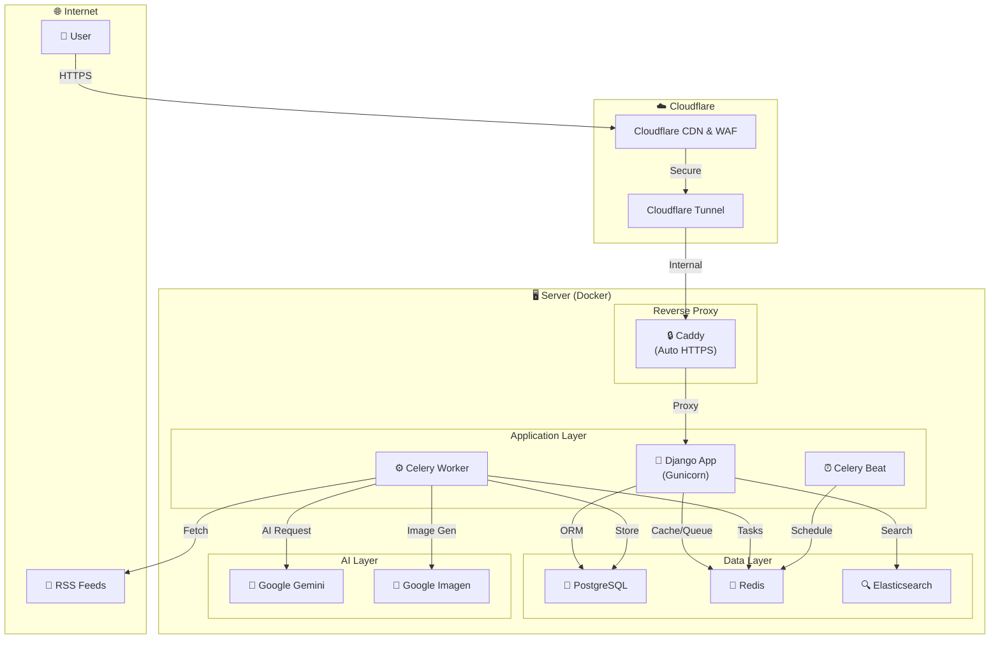
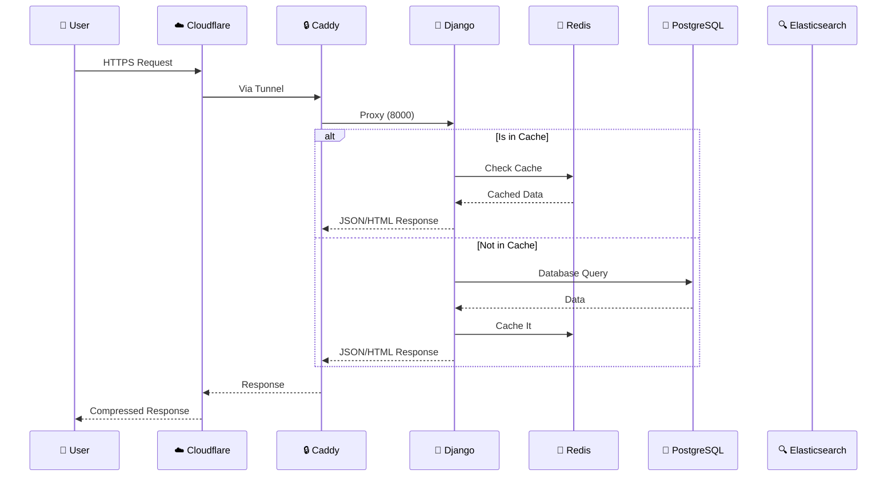
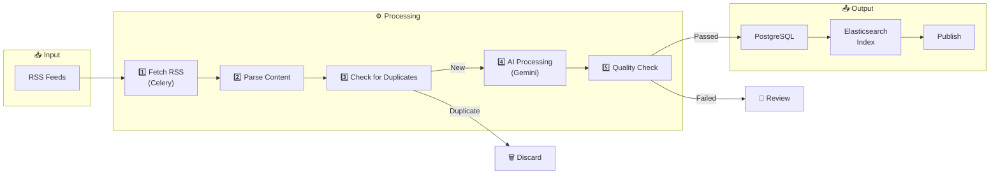
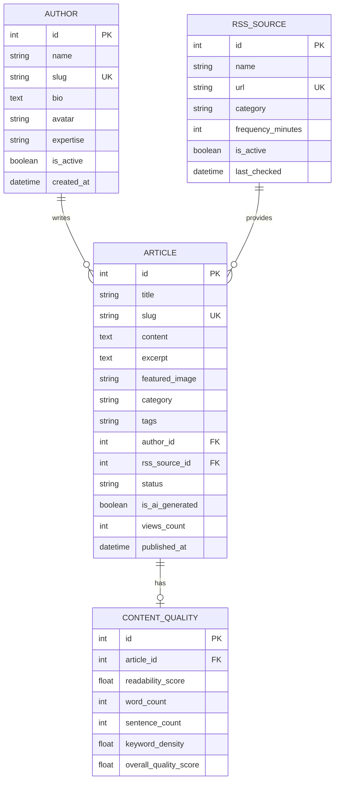
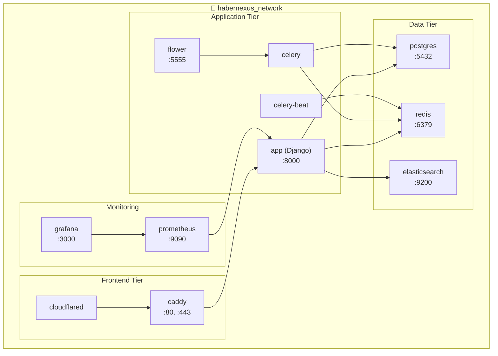

## HaberNexus Architecture and Project Structure

This document details the technical architecture, technologies used, and folder structure of the HaberNexus project.

---

### Technologies

| Category | Technology | Description |
|---|---|---|
| **Backend** | Python 3.11, Django 5.1 | Main application framework. |
| **Frontend** | Tailwind CSS, Django Templates | Modern and fast interface development. |
| **Database** | PostgreSQL | Reliable and scalable primary database. |
| **Asynchronous Tasks** | Celery, Redis | Queue system for background tasks (RSS fetching, AI operations). |
| **Search** | Elasticsearch | Advanced and fast text-based search. |
| **AI & Machine Learning** | Google Gemini, Spacy | Content generation, summarization, and natural language processing. |
| **Deployment** | Docker, Caddy, Cloudflare Tunnel | Containerization, automatic HTTPS, and secure access. |
| **CI/CD** | GitHub Actions | Automatic testing, code quality control, and deployment. |

---

### System Architecture Diagram

The following diagram shows the overall system architecture of HaberNexus:



---

### Request Flow Diagram

The flow of how a user request is processed in the system:



---

### News Processing Pipeline

The flow of how news is processed from RSS sources:



---

### Database Schema (ER Diagram)

Diagram showing the relationships of the main database tables:



---

### Docker Service Structure

The structure of services running with Docker Compose:



---

### Project Folder Structure

The project is organized in a modular way in accordance with Django's "apps" concept.

```
/habernexus
├── api/                  # All code related to the REST API (views, serializers, urls)
├── authors/              # Author management application (models, admin)
├── core/                 # Core components of the project (middleware, management commands, settings)
├── habernexus_config/    # Main configuration files of the project (settings.py, urls.py, celery.py)
├── news/                 # News management application (models, views, tasks, admin)
├── static/               # Static files (CSS, JS, images)
├── templates/            # Django HTML templates
├── tests/                # Automatic tests
├── .github/              # GitHub Actions (CI/CD) and issue templates
├── caddy/                # Caddy configuration files
├── cloudflared/          # Cloudflare Tunnel configuration files
├── docker-compose.yml    # Docker Compose file for the development environment
├── docker-compose.prod.yml # Docker Compose file for the production environment
├── Dockerfile            # To create the Docker image of the Django application
├── manage.py             # Django management script
├── requirements.txt      # Python dependencies
└── README.md             # Project main page
```

### Application (App) Descriptions

-   **`api`**: Contains the logic of the REST API presented to the outside world. Endpoints are in `views.py`, data models are in `serializers.py`.
-   **`authors`**: Django app that manages authors and their related information.
-   **`core`**: Contains cross-cutting components used throughout the project, such as helper functions, custom middleware layers, management commands, and base models.
-   **`habernexus_config`**: The main configuration center of the Django project. All settings are in `settings.py`, main URL routings are in `urls.py`, and asynchronous task configuration is in `celery.py`.
-   **`news`**: The heart of the project. It contains the main models such as News (`Article`) and RSS Source (`RssSource`), the `views.py` where news is listed and its details are shown, and most importantly, the `tasks.py` file that scans RSS sources and generates content with AI.
