## HaberNexus Architecture and Project Structure

This document details the technical architecture, technologies used, and folder structure of the HaberNexus project.

---

### Technologies

| Category | Technology | Description |
|---|---|---|
| **Backend** | Python 3.11, Django 5.1 | Main application framework. |
| **Frontend** | Tailwind CSS, Django Templates | Modern and fast interface development. |
| **Database** | PostgreSQL | Reliable and scalable primary database. |
| **Asynchronous Tasks** | Celery, Redis | Queue system for background tasks (RSS fetching, AI operations). |
| **Search** | Elasticsearch | Advanced and fast text-based search. |
| **AI & Machine Learning** | Google Gemini, Spacy | Content generation, summarization, and natural language processing. |
| **Deployment** | Docker, Caddy, Cloudflare Tunnel | Containerization, automatic HTTPS, and secure access. |
| **CI/CD** | GitHub Actions | Automatic testing, code quality control, and deployment. |

---

### System Architecture Diagram

The following diagram shows the overall system architecture of HaberNexus:

```mermaid
flowchart TB
    subgraph Internet["🌐 Internet"]
        User["👤 User"]
        RSSFeeds["📰 RSS Feeds"]
    end

    subgraph CloudflareLayer["☁️ Cloudflare"]
        CF["Cloudflare CDN & WAF"]
        Tunnel["Cloudflare Tunnel"]
    end

    subgraph Server["🖥️ Server (Docker)"]
        subgraph ReverseProxy["Reverse Proxy"]
            Caddy["🔒 Caddy\n(Auto HTTPS)"]
        end

        subgraph AppLayer["Application Layer"]
            Django["🐍 Django App\n(Gunicorn)"]
            Celery["⚙️ Celery Worker"]
            CeleryBeat["⏰ Celery Beat"]
        end

        subgraph DataLayer["Data Layer"]
            PostgreSQL["🐘 PostgreSQL"]
            Redis["🔴 Redis"]
            Elasticsearch["🔍 Elasticsearch"]
        end

        subgraph AILayer["AI Layer"]
            Gemini["🤖 Google Gemini"]
            Imagen["🎨 Google Imagen"]
        end
    end

    User -->|HTTPS| CF
    CF -->|Secure| Tunnel
    Tunnel -->|Internal| Caddy
    Caddy -->|Proxy| Django

    Django -->|ORM| PostgreSQL
    Django -->|Cache/Queue| Redis
    Django -->|Search| Elasticsearch

    Celery -->|Tasks| Redis
    CeleryBeat -->|Schedule| Redis
    Celery -->|Fetch| RSSFeeds
    Celery -->|AI Request| Gemini
    Celery -->|Image Gen| Imagen

    Celery -->|Store| PostgreSQL
```



---

### Request Flow Diagram

The flow of how a user request is processed in the system:

```mermaid
sequenceDiagram
    participant U as 👤 User
    participant CF as ☁️ Cloudflare
    participant C as 🔒 Caddy
    participant D as 🐍 Django
    participant R as 🔴 Redis
    participant P as 🐘 PostgreSQL
    participant E as 🔍 Elasticsearch

    U->>CF: HTTPS Request
    CF->>C: Via Tunnel
    C->>D: Proxy (8000)
    
    alt Is in Cache
        D->>R: Check Cache
        R-->>D: Cached Data
        D-->>C: JSON/HTML Response
    else Not in Cache
        D->>P: Database Query
        P-->>D: Data
        D->>R: Cache It
        D-->>C: JSON/HTML Response
    end
    
    C-->>CF: Response
    CF-->>U: Compressed Response
```



---

### News Processing Pipeline

The flow of how news is processed from RSS sources:

```mermaid
flowchart LR
    subgraph Input["📥 Input"]
        RSS["RSS Feeds"]
    end

    subgraph Processing["⚙️ Processing"]
        Fetch["1️⃣ Fetch RSS\n(Celery)"]
        Parse["2️⃣ Parse Content"]
        Duplicate["3️⃣ Check for Duplicates"]
        AI["4️⃣ AI Processing\n(Gemini)"]
        Quality["5️⃣ Quality Check"]
    end

    subgraph Output["📤 Output"]
        DB["PostgreSQL"]
        Index["Elasticsearch\nIndex"]
        Publish["Publish"]
    end

    RSS --> Fetch
    Fetch --> Parse
    Parse --> Duplicate
    Duplicate -->|New| AI
    Duplicate -->|Duplicate| Discard["🗑️ Discard"]
    AI --> Quality
    Quality -->|Passed| DB
    Quality -->|Failed| Review["📝 Review"]
    DB --> Index
    Index --> Publish
```



---

### Database Schema (ER Diagram)

Diagram showing the relationships of the main database tables:


---

### Docker Service Structure

The structure of services running with Docker Compose:

```mermaid
graph TB
    subgraph DockerNetwork["🐳 habernexus_network"]
        subgraph Frontend["Frontend Tier"]
            caddy["caddy\n:80, :443"]
            cloudflared["cloudflared"]
        end

        subgraph Application["Application Tier"]
            app["app (Django)\n:8000"]
            celery["celery"]
            celery_beat["celery-beat"]
            flower["flower\n:5555"]
        end

        subgraph Data["Data Tier"]
            postgres["postgres\n:5432"]
            redis["redis\n:6379"]
            elasticsearch["elasticsearch\n:9200"]
        end

        subgraph Monitoring["Monitoring"]
            prometheus["prometheus\n:9090"]
            grafana["grafana\n:3000"]
        end
    end

    cloudflared --> caddy
    caddy --> app
    app --> postgres
    app --> redis
    app --> elasticsearch
    celery --> redis
    celery --> postgres
    celery_beat --> redis
    flower --> celery
    prometheus --> app
    grafana --> prometheus
```



---

### Project Folder Structure

The project is organized in a modular way in accordance with Django's "apps" concept.

```
/habernexus
├── api/                  # All code related to the REST API (views, serializers, urls)
├── authors/              # Author management application (models, admin)
├── core/                 # Core components of the project (middleware, management commands, settings)
├── habernexus_config/    # Main configuration files of the project (settings.py, urls.py, celery.py)
├── news/                 # News management application (models, views, tasks, admin)
├── static/               # Static files (CSS, JS, images)
├── templates/            # Django HTML templates
├── tests/                # Automatic tests
├── .github/              # GitHub Actions (CI/CD) and issue templates
├── caddy/                # Caddy configuration files
├── cloudflared/          # Cloudflare Tunnel configuration files
├── docker-compose.yml    # Docker Compose file for the development environment
├── docker-compose.prod.yml # Docker Compose file for the production environment
├── Dockerfile            # To create the Docker image of the Django application
├── manage.py             # Django management script
├── requirements.txt      # Python dependencies
└── README.md             # Project main page
```

### Application (App) Descriptions

-   **`api`**: Contains the logic of the REST API presented to the outside world. Endpoints are in `views.py`, data models are in `serializers.py`.
-   **`authors`**: Django app that manages authors and their related information.
-   **`core`**: Contains cross-cutting components used throughout the project, such as helper functions, custom middleware layers, management commands, and base models.
-   **`habernexus_config`**: The main configuration center of the Django project. All settings are in `settings.py`, main URL routings are in `urls.py`, and asynchronous task configuration is in `celery.py`.
-   **`news`**: The heart of the project. It contains the main models such as News (`Article`) and RSS Source (`RssSource`), the `views.py` where news is listed and its details are shown, and most importantly, the `tasks.py` file that scans RSS sources and generates content with AI.
