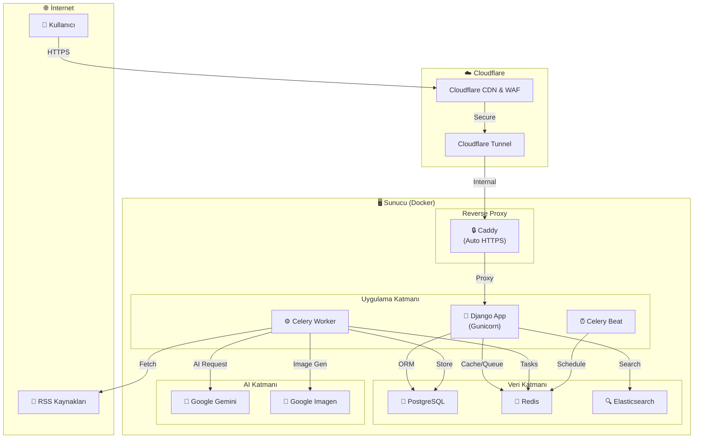
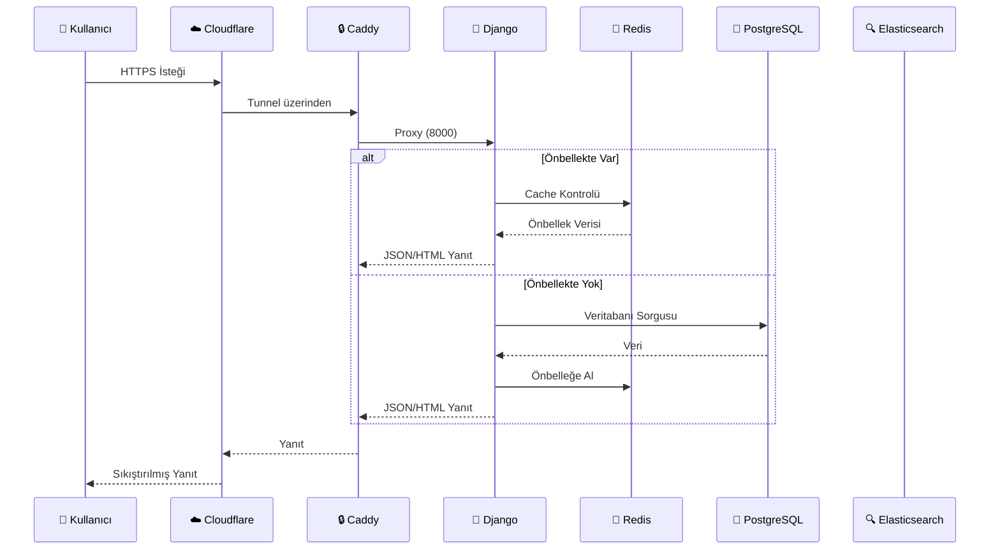
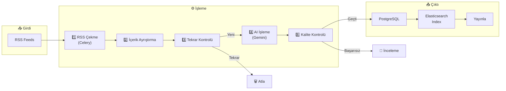
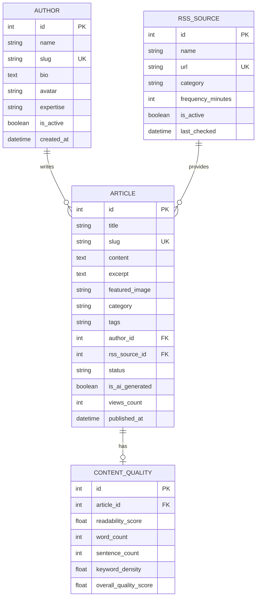
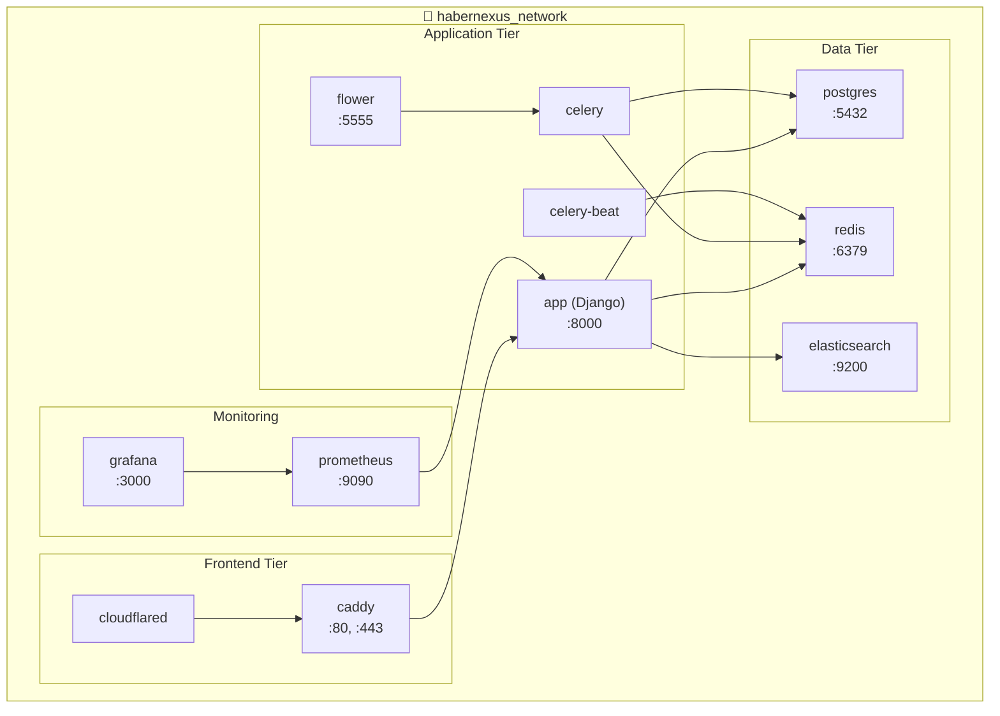

## HaberNexus Mimarisi ve Proje Yapısı

Bu doküman, HaberNexus projesinin teknik mimarisini, kullanılan teknolojileri ve klasör yapısını detaylandırmaktadır.

---

### Teknolojiler

| Kategori | Teknoloji | Açıklama |
|---|---|---|
| **Backend** | Python 3.11, Django 5.1 | Ana uygulama çerçevesi. |
| **Frontend** | Tailwind CSS, Django Templates | Modern ve hızlı arayüz geliştirme. |
| **Veritabanı** | PostgreSQL | Güvenilir ve ölçeklenebilir birincil veritabanı. |
| **Asenkron Görevler** | Celery, Redis | Arka plan görevleri (RSS çekme, AI işlemleri) için kuyruk sistemi. |
| **Arama** | Elasticsearch | Gelişmiş ve hızlı metin tabanlı arama. |
| **AI & Makine Öğrenmesi** | Google Gemini, Spacy | İçerik üretimi, özetleme ve doğal dil işleme. |
| **Deployment** | Docker, Caddy, Cloudflare Tunnel | Konteynerleştirme, otomatik HTTPS ve güvenli erişim. |
| **CI/CD** | GitHub Actions | Otomatik test, kod kalitesi kontrolü ve dağıtım. |

---

### Sistem Mimarisi Diyagramı

Aşağıdaki diyagram, HaberNexus'un genel sistem mimarisini göstermektedir:



---

### İstek Akışı Diyagramı

Bir kullanıcı isteğinin sistemde nasıl işlendiğini gösteren akış:



---

### Haber İşleme Pipeline'ı

RSS kaynaklarından haberlerin nasıl işlendiğini gösteren akış:



---

### Veritabanı Şeması (ER Diyagramı)

Ana veritabanı tablolarının ilişkilerini gösteren diyagram:



---

### Docker Servis Yapısı

Docker Compose ile çalışan servislerin yapısı:



---

### Proje Klasör Yapısı

Proje, Django'nun "apps" konseptine uygun olarak modüler bir şekilde düzenlenmiştir.

```
/habernexus
├── api/                  # REST API ile ilgili tüm kodlar (views, serializers, urls)
├── authors/              # Yazar yönetimi uygulaması (models, admin)
├── core/                 # Projenin temel bileşenleri (middleware, management commands, settings)
├── habernexus_config/    # Projenin ana yapılandırma dosyaları (settings.py, urls.py, celery.py)
├── news/                 # Haber yönetimi uygulaması (models, views, tasks, admin)
├── static/               # Statik dosyalar (CSS, JS, resimler)
├── templates/            # Django HTML şablonları
├── tests/                # Otomatik testler
├── .github/              # GitHub Actions (CI/CD) ve issue şablonları
├── caddy/                # Caddy yapılandırma dosyaları
├── cloudflared/          # Cloudflare Tunnel yapılandırma dosyaları
├── docker-compose.yml    # Geliştirme ortamı için Docker Compose dosyası
├── docker-compose.prod.yml # Production ortamı için Docker Compose dosyası
├── Dockerfile            # Django uygulamasının Docker imajını oluşturmak için
├── manage.py             # Django yönetim betiği
├── requirements.txt      # Python bağımlılıkları
└── README.md             # Proje ana sayfası
```

### Uygulama (App) Açıklamaları

-   **`api`**: Dış dünyaya sunulan REST API'nin mantığını içerir. `views.py` içinde endpoint'ler, `serializers.py` içinde veri modelleri bulunur.
-   **`authors`**: Yazarları ve onlarla ilgili bilgileri yöneten Django app'i.
-   **`core`**: Projenin genelinde kullanılan yardımcı fonksiyonlar, özel middleware katmanları, yönetim komutları ve temel modeller gibi çapraz kesen bileşenleri barındırır.
-   **`habernexus_config`**: Django projesinin ana yapılandırma merkezidir. `settings.py` ile tüm ayarlar, `urls.py` ile ana URL yönlendirmeleri ve `celery.py` ile asenkron görev yapılandırması burada yer alır.
-   **`news`**: Projenin kalbidir. Haber (`Article`), RSS Kaynağı (`RssSource`) gibi ana modelleri, haberlerin listelendiği ve detaylarının gösterildiği `views.py`'ı ve en önemlisi, RSS kaynaklarını tarayan, AI ile içerik üreten `tasks.py` dosyasını içerir.
